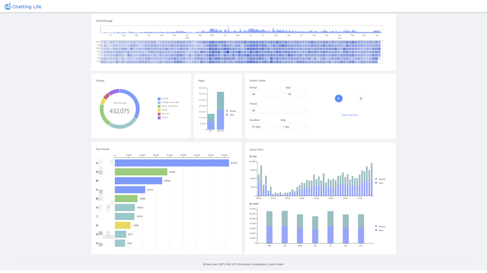

# Chatting Life – Information Visualization Course Project

@Harrilee | harrylee@nyu.edu

This project was bootstrapped with [Create React App](https://github.com/facebook/create-react-app).




## Get Your Own Data

See folder `data_processing` and view [data_processing documentation](./data_processing/README.md)


## View the Data
See folder `frontend`

### View Build Version
Go to `./build` folder, load `index.html` into your local static server (such as Live Server or Appache)

There might be some issue involving data path, if this happend, please view it in development code.

### View Development Code
The code for the main page is in `./src/App.js`. with coressponding css file `./src/App.css`.

### About `node modules`
To simplify the package, the `node modules` folder is not included. You should reinstall the package dependencies by
```bat
npm install
```

## Data privacy
The package includes a sample data derived from author's WeChat and QQ chat history. Data masking is performed to eliminate potential risks.

